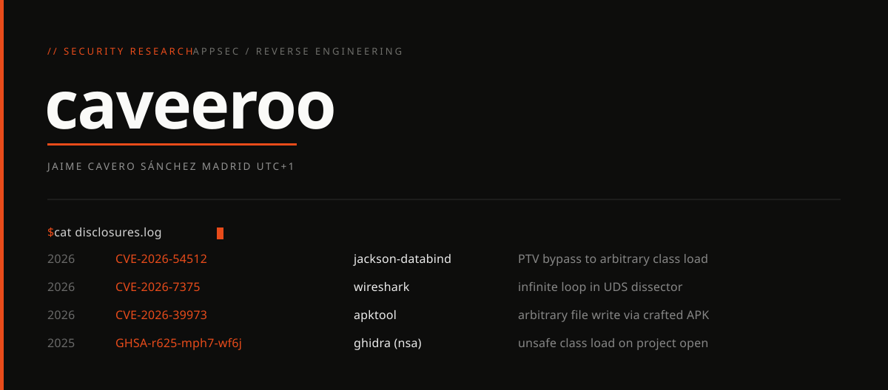

### Disclosures

`CVE-2026-54512` · **jackson-databind** · [advisory ↗](https://github.com/FasterXML/jackson-databind/security/advisories/GHSA-j3rv-43j4-c7qm)  
PolymorphicTypeValidator bypass via generic type parameters. A denied class smuggled as a generic argument of an allow-listed container (`ArrayList<Evil>`) is instantiated with attacker-controlled properties, defeating the PTV allow-list and opening an unauthenticated RCE path. Fixed in 2.18.8 / 2.21.4 / 3.1.4.

`CVE-2026-7375` · **wireshark** · [advisory ↗](https://www.cve.org/CVERecord?id=CVE-2026-7375)  
Infinite loop in the UDS dissector. A crafted packet, live capture or PCAP, hangs it. Fixed in 4.6.5 / 4.4.15.

`CVE-2026-39973` · **apktool** · [advisory ↗](https://www.cve.org/CVERecord?id=CVE-2026-39973)  
Arbitrary file write on decode. A dropped path-sanitization check let a crafted APK write outside the output directory. Fixed in 3.0.2.

`GHSA-r625-mph7-wf6j` · **ghidra** (nsa) · [advisory ↗](https://github.com/NationalSecurityAgency/ghidra/security/advisories/GHSA-r625-mph7-wf6j)  
Unsafe deserialization. Opening a malicious project instantiates attacker-specified classes. Reported to the National Security Agency.

[caveeroo.dev](https://caveeroo.dev) · madrid
